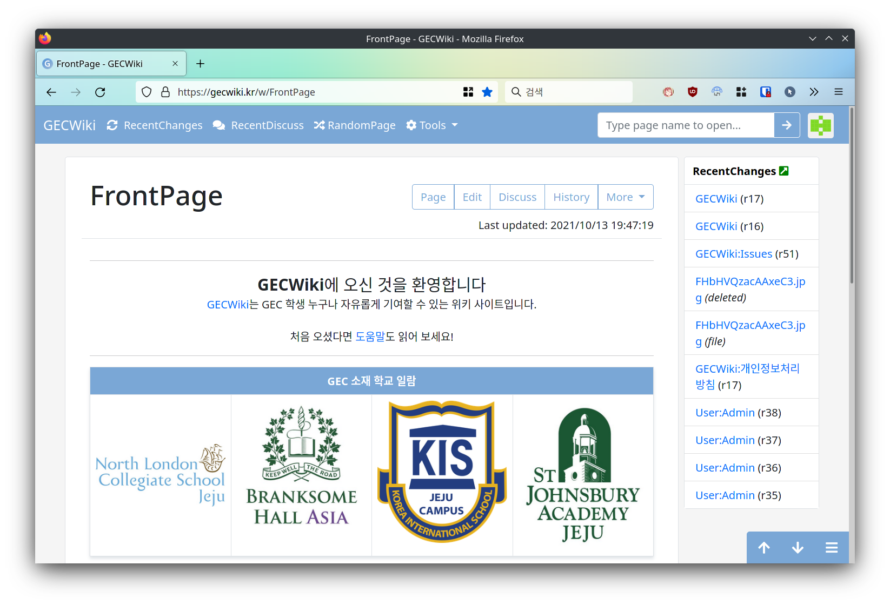

# AkariEngine

AkariEngine is a nodejs based wiki engine. It was started as a toy project, but it was then developed for use in [GECWiki](https://gecwiki.kr).

## Getting Started
Please refer to [installation page on the wiki](https://github.com/kbmin24/AkariEngine/wiki/Installation).

## Licence
AkariEngine is distributed under GNU AGPL 3.0.

## Why am I opening the code?
I am making this project open source because:
 * I would like to record my progress (of learning how to code when I am in high school);
 * I am hoping that someone would find this project useful in developing their own wiki engines.

I am '''not''' making this project open source because
 * I hope others to use this wiki engine right away. (It is OK to do so, but as this engine was made specifically for GECWiki, I do not guarantee its usability or liability.)

## Disclaimer
 * AkariEngine is designed specifically for [GECWiki](https://gecwiki.kr); therefore, it may __not__ be suitable for general use.
 * All interfaces are in Korean. (If looking for english interface, please check [this version](https://github.com/kbmin24/AkariEngine/tree/a3c8afb6d532ca2704456efe13e19a8fb531f0fe) or older.
