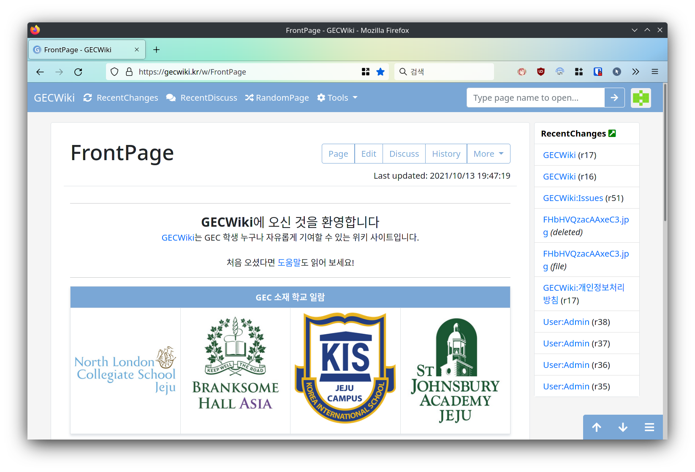

# AkariEngine

AkariEngine is a nodejs based wiki engine. It served as the wiki engine for the retired [GECWiki](https://gecwiki.kr) website from 2022 to 2024.

## Features
AkariEngine is a simple yet versatile wiki engine with the following features:
* Simple and powerful markup (grammar) with features such as tables, videos and maps
* Real time, thread-like discussion
* Flexible database choice
* Built in permission/ACL management
* Extensible by design: various skins available to customise the look and an avilable extension system

## Getting Started
Please refer to the wiki's [installation page](https://github.com/kbmin24/AkariEngine/wiki/Installation).

## Licence
AkariEngine is distributed under GNU AGPL 3.0.
