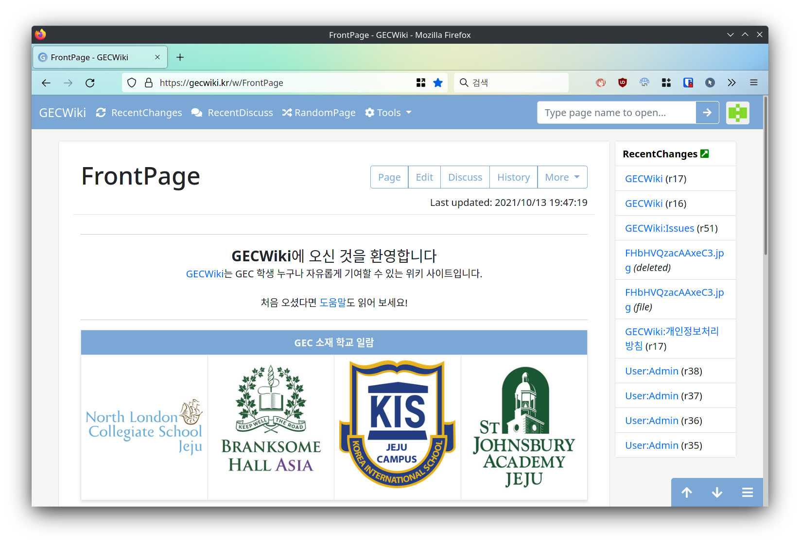

# AkariEngine

AkariEngine is a nodejs based wiki engine.

## Features
AkariEngine is a simple yet versatile wiki engine with the following features:
* Simple and powerful markup (grammar) with features such as tables, videos and maps
* Blazing fast wikitext rendering using [Chevrotain](https://chevrotain.io/docs/)
* To-the-point, no hassle configuration with a single .json file
* Real time, thread-like discussion with Socket.IO
* Flexible database choice supporting MySQL/MariaDB and SQLite
* Built in permission/ACL management
* Extensible by design: various skins available to customise the look and an avilable extension system
* Full text search via Meilisearch

### Use cases
* [GECWiki](https://gecwiki.kr) (website retired)

## Getting Started
Please refer to the wiki's [installation page](https://github.com/kbmin24/AkariEngine/wiki/Installation).

## Licence
AkariEngine is distributed under GNU AGPL 3.0.
